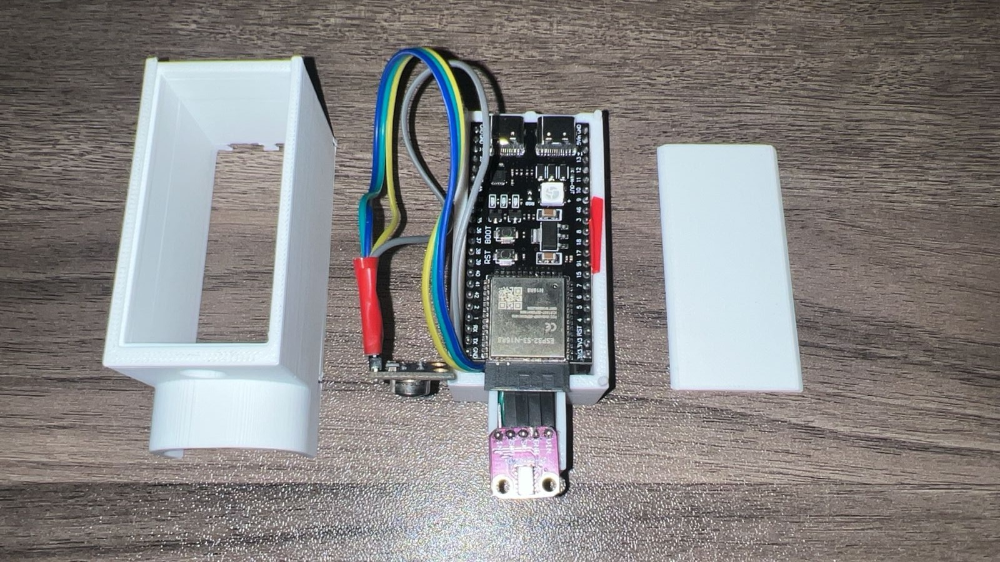
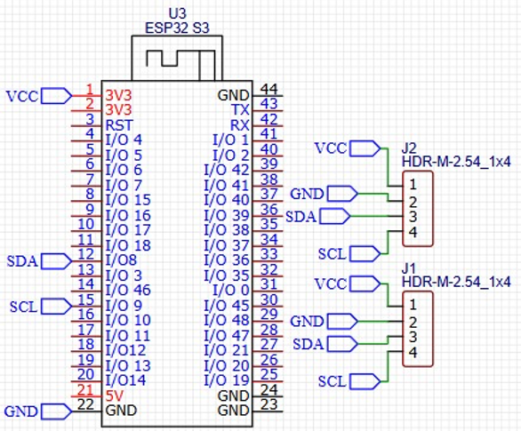
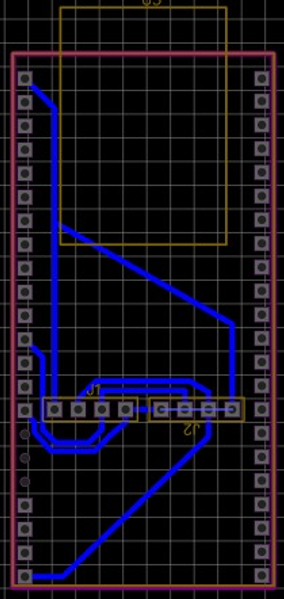
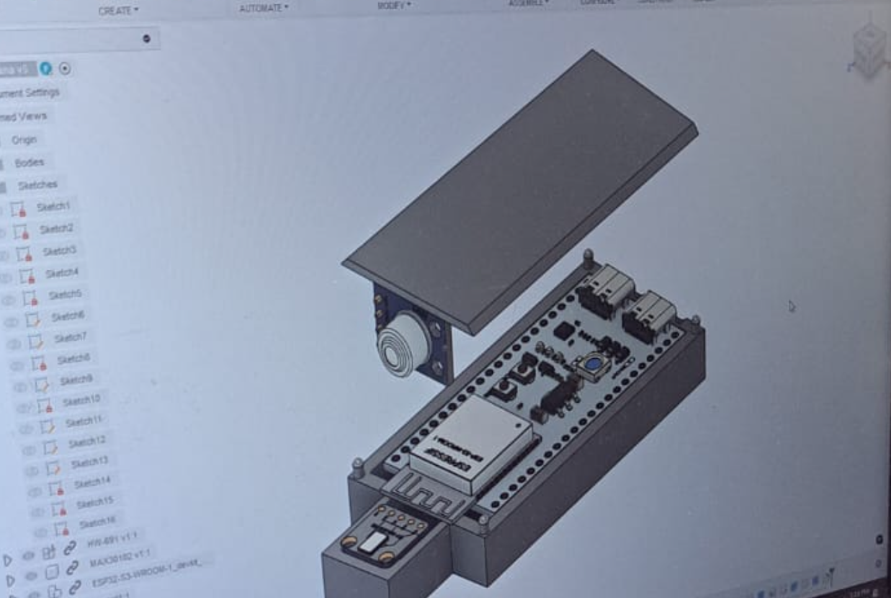
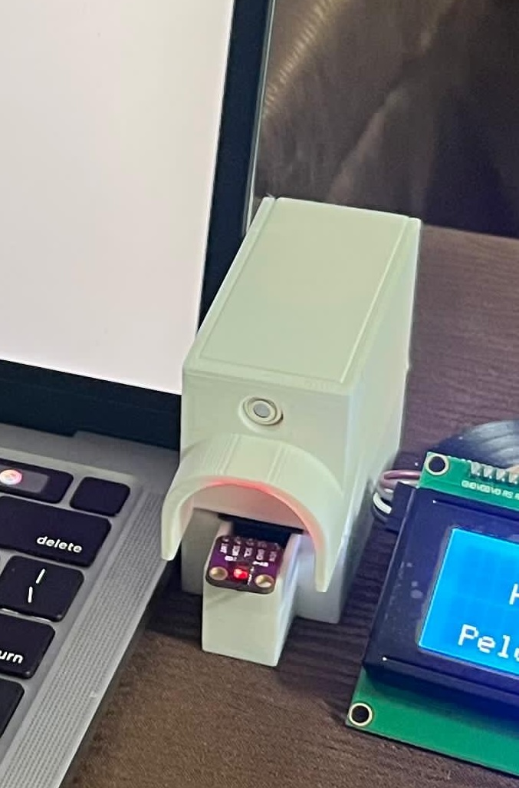

# 🔵 Triana Bluetooth Sensor Device

A compact hardware device for wirelessly reading body temperature and heart rate using MQTT. Built with a custom PCB and 3D-printed casing for **OmSehat**.

---

## 🖥️ Schematic

> _Circuit connection overview._

---

## 🔌 PCB Design

> _Top view of the custom PCB layout._

---

## 🧱 3D Casing

> _Render or photo of the 3D-printed enclosure._

---

## ✅ Final Result

> _Photo of the fully assembled hardware._

---

## 📲 Features

- MQTT connection using ESP32
- Reads:

  - Body temperature
  - Heart rate

- Simple command interface via MQTT

---

## 🚀 How It Works

1. Power on the device
2. Connect to the OmSehat app
3. Send a command via MQTT
4. Data is sent back via MQTT

## 📎 Links

- 🌐 [OmSehat Web App](https://omsehat.sportsnow.app)
